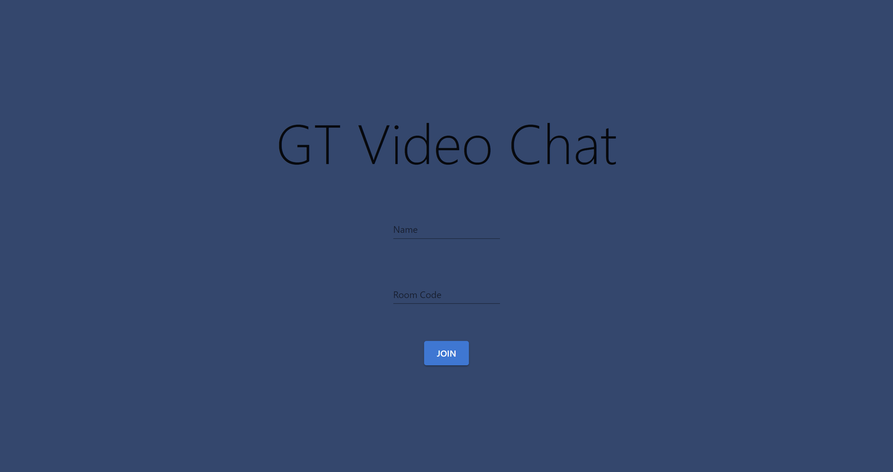
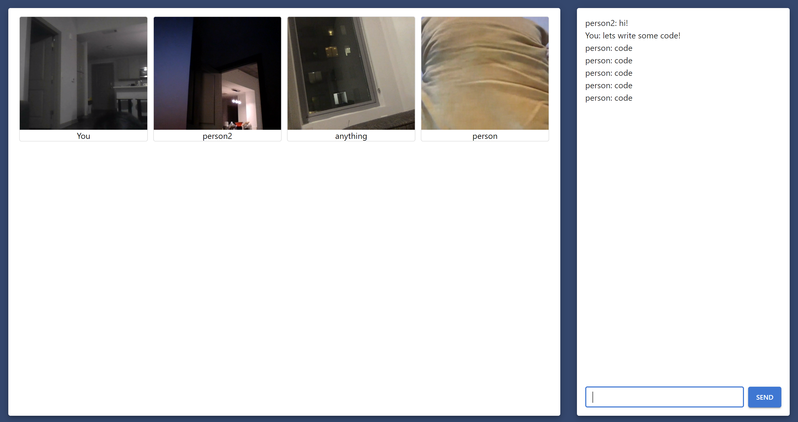

# Video Chat A

## Overview

Simple video chat application using Node.js, React, Socket.io, Express, and PeerJS with a fully functional naming system, room system, text chat, and video & audio transmission. Click [here](https://web-video-chat-web-app.herokuapp.com/home) for a live demo page.

## Installation

1. Clone or download the repository.
2. Install dependencies by running `npm install` in the root project directory.
3. run `npm start` and `node.js src/server.js` in the root project directory to start the server.
4. Open [http://localhost:3000](http://localhost:3000) to view it in your browser.
